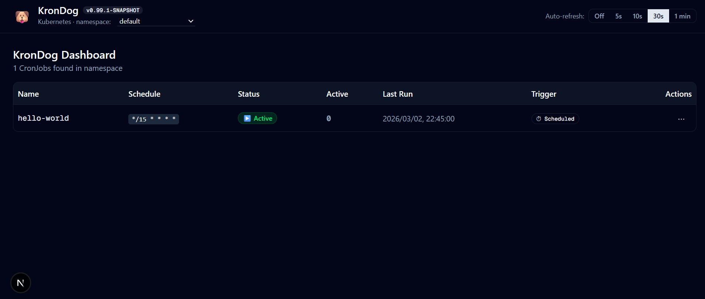
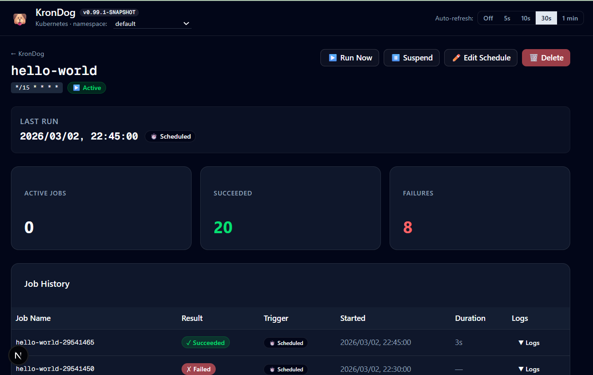

🇬🇧 [Read in English](README.md)

# 🐶 KronDog
**KronDog** è una web dashboard leggera e moderna per monitorare e gestire i CronJob di Kubernetes direttamente dal tuo browser.

Progettato per sviluppatori e amministratori di sistema, KronDog fornisce un'interfaccia pulita sopra le API native di Kubernetes, permettendoti di visualizzare istantaneamente i job attivi, controllare la cronologia delle esecuzioni (sia pianificate che avviate manualmente), analizzare errori di validazione esatti e gestire le pianificazioni cron in modo visuale, invece di lottare con i manifest YAML nel terminale.

## 📸 Anteprima

### 1. Dashboard Principale
Una panoramica di alto livello di tutti i tuoi CronJob, mostrando lo stato attivo, il timestamp reale dell'ultima esecuzione e l'espressione di pianificazione:

### 2. Dettagli e Cronologia Job
Cliccando su qualsiasi CronJob è possibile vedere la cronologia profonda, la durata delle esecuzioni, i pod attivi e l'origine esatta degli avvii (Pianificati vs Manuali):

## 🚀 Funzionalità
- **Panoramica Dashboard**: Monitora tutti i CronJob nel namespace selezionato.
- **Avvii Manuali**: Avvia i Job manualmente (Run Now) e vedili immediatamente contrassegnati dal badge `✋ Manual` nelle colonne dell'Ultima Esecuzione.
- **Vero "Last Run Time"**: A differenza del `kubectl` nativo, KronDog calcola in modo intelligente il _vero_ orario dell'ultima esecuzione, includendo anche gli avvii manuali.
- **Gestione Pianificazione**: Modifica e salva le espressioni `spec.schedule` direttamente nel browser ricevendo in tempo reale gli errori di validazione dalle API di Kubernetes.
- **Cronologia Job**: Clicca su qualsiasi CronJob per vedere lo storico dei Job recenti, durata, stato (successo/fallimento) e i pod attualmente attivi.
- **Log dei Pod in Diretta**: Effettua lo streaming Server-Sent Events (SSE) direttamente dai Pod Kubernetes nel terminale del browser.

> ⚠️ **ATTENZIONE**: Questo progetto è sperimentale e rappresenta una sperimentazione personale con finalità di studio e apprendimento. Combina sviluppo manuale con l'utilizzo di agenti AI per esplorare nuove modalità di lavoro. Non è production-ready, potrebbe contenere bug o comportamenti imprevisti, e non è garantita alcuna stabilità o supporto. Usalo a tuo rischio e per scopi educativi! 🎯

## 🛠️ Stack Tecnologico e Versioni
Questo progetto è costruito utilizzando una moderna architettura full-stack in Typescript:
- **Framework**: [Next.js](https://nextjs.org/) (`16.1.6`) con App Router
- **UI e Componenti**: [React](https://react.dev/) (`19.2.3`), [Tailwind CSS](https://tailwindcss.com/) (`^4`), e [Shadcn UI](https://ui.shadcn.com/) (`^3.8.5`)
- **Gestione dello Stato**: [TanStack React Query](https://tanstack.com/query/latest) (`^5.90.21`)
- **Integrazione Kubernetes**: [Client Ufficiale Kubernetes per Node.js](https://github.com/kubernetes-client/javascript) (`@kubernetes/client-node: ^1.4.0`)
- **Icone**: [Lucide React](https://lucide.dev/) (`^0.576.0`)

## 📚 Documentazione
Per le istruzioni complete su come autenticarsi con il cluster Kubernetes (Minikube, EKS, GKE, ecc.) e per effettuare il deploy dell'applicazione, fai riferimento alla guida dedicata:
👉 **[Guida all'Autenticazione e al Deploy](docs/autenticazione-e-deploy.md)**
