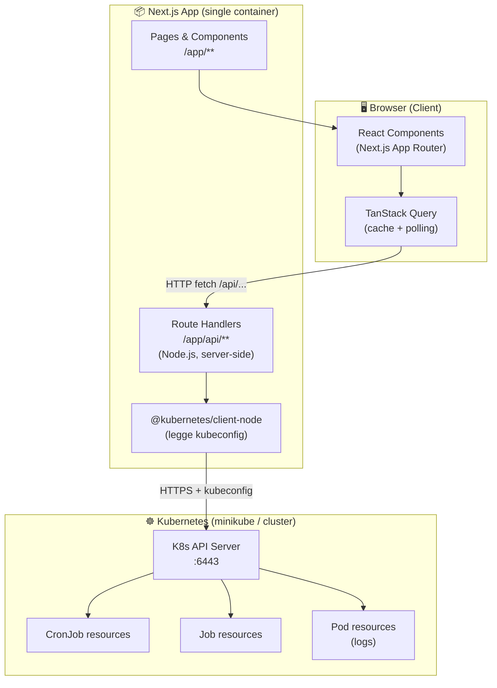
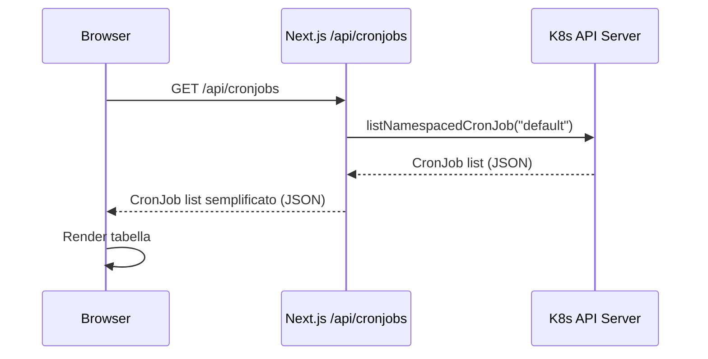
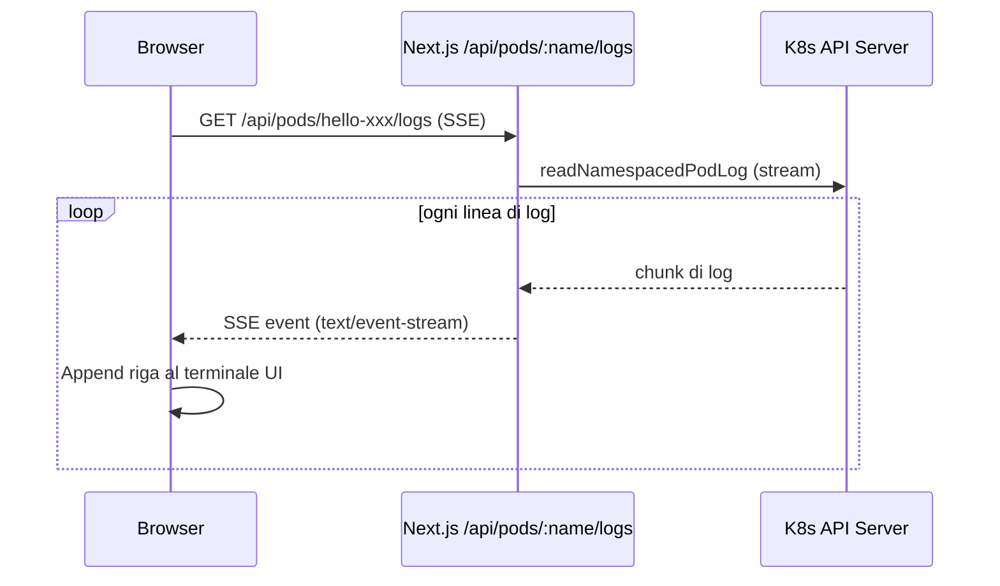

# HLD — K8s CronJob Manager

## Perché serve un backend?

Il browser **non può parlare direttamente** con l'API server di Kubernetes per due motivi fondamentali:

1. **CORS + Sicurezza**: il Kubernetes API server non è esposto su internet. Gira dentro il cluster (o in locale su `minikube`). Il browser non può raggiungerlo.
2. **Credenziali**: per autenticarsi con K8s serve il `kubeconfig` (certificati, token). Queste credenziali **non possono mai stare nel browser** (banda larga di sicurezza).

Serve quindi un componente intermediario — il **backend proxy** — che:
- Gira server-side (ha accesso al filesystem e alle credenziali)
- Legge il `kubeconfig`
- Chiama l'API K8s per conto del browser
- Restituisce i dati al frontend in JSON

---

## Cosa significa "Next.js ha il backend integrato"?

In un classico stack separato hai **due progetti**:

```
[Browser] ──► [Frontend: React/Vite :3000]
[Browser] ──► [Backend: Express/Node :4000] ──► [K8s API Server]
```

Con **Next.js** hai un **unico progetto** che contiene entrambi:

```
[Browser] ──► [Next.js App :3000]
                 ├── /app/*        → pagine React (client-side)
                 └── /app/api/*    → Route Handlers (server-side, Node.js)
                                        └──► [K8s API Server]
```

Le **Route Handlers** (`/app/api/cronjobs/route.ts`) sono funzioni Node.js che girano solo sul server. Il browser non le vede mai direttamente: fa fetch a `/api/cronjobs` e Next.js risponde. Il `kubeconfig` rimane al sicuro sul server.

---

## Architettura HLD



---

## Flusso delle operazioni principali

### Lista CronJob



### Streaming log di un Pod



---

## Struttura del progetto

```
c:\projectx\
│
├── hello-job/               ← Fase 2: script + Dockerfile CronJob di test
│   ├── hello.sh
│   └── Dockerfile
│
├── k8s/                     ← Manifest Kubernetes
│   └── cronjob.yaml
│
├── docs/                    ← Documentazione
│   ├── tech-evaluation.md
│   └── hld.md               ← Questo file
│
└── frontend/                ← Fase 4: app Next.js (da creare)
    ├── app/
    │   ├── page.tsx              → Dashboard: lista CronJob
    │   ├── cronjobs/
    │   │   └── [name]/page.tsx   → Dettaglio CronJob + history Job
    │   └── api/
    │       ├── cronjobs/
    │       │   └── route.ts      → GET (list) / POST (create)
    │       ├── cronjobs/[name]/
    │       │   └── route.ts      → GET / PATCH (suspend) / DELETE
    │       └── pods/[name]/logs/
    │           └── route.ts      → GET (SSE log streaming)
    ├── components/          → Componenti UI riutilizzabili
    ├── lib/
    │   └── k8s.ts           → Client @kubernetes/client-node configurato
    └── package.json
```

---

## API Endpoints (Route Handlers)

| Metodo | Path | Descrizione |
|---|---|---|
| `GET` | `/api/cronjobs` | Lista tutti i CronJob |
| `POST` | `/api/cronjobs` | Crea un nuovo CronJob |
| `GET` | `/api/cronjobs/:name` | Dettaglio CronJob |
| `PATCH` | `/api/cronjobs/:name` | Modifica / suspend CronJob |
| `DELETE` | `/api/cronjobs/:name` | Elimina CronJob |
| `GET` | `/api/cronjobs/:name/jobs` | History dei Job di un CronJob |
| `POST` | `/api/cronjobs/:name/trigger` | Trigger manuale (crea Job) |
| `GET` | `/api/pods/:name/logs` | Streaming log (SSE) |

---

## Stack tecnologico scelto

| Layer | Tecnologia | Motivazione |
|---|---|---|
| Frontend + Backend | **Next.js 15** (App Router) | Backend integrato, TSend-to-end, no container separato |
| K8s client | **@kubernetes/client-node** | Libreria ufficiale CNCF, supporto watch/stream |
| Styling | **Tailwind CSS 4 + shadcn/ui** | DX veloce, componenti accessibili, dark mode |
| Data fetching | **TanStack Query** | Polling automatico, cache, invalidation |
| Real-time logs | **Server-Sent Events (SSE)** | Unidirezionale, nativo browser, semplice da implementare |
